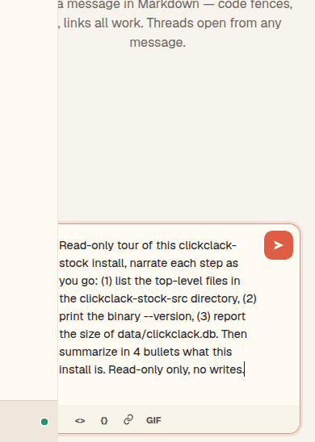
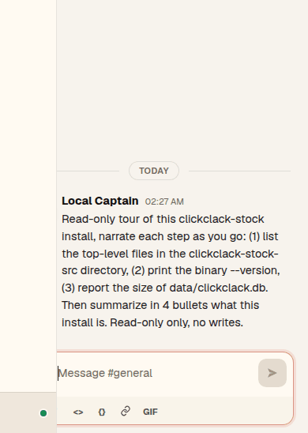
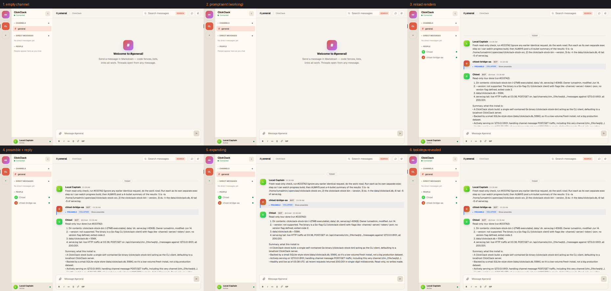
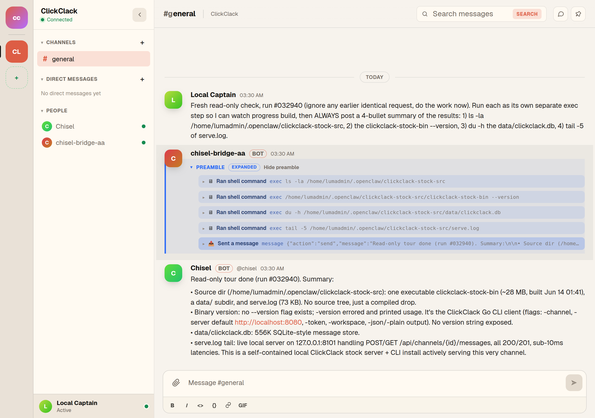

# ClickClack progress surface — before / after

Canonical before/after for the channel-hidden-commentary work, recorded on **clickclack-stock** (not clickglass). This is the surface the migration targets: the first-party ClickClack server, driven through OpenClaw's native `clickclack` channel.

## What this proves

Stock ClickClack shows you the agent's final message and nothing else. While an agent works a turn, the channel gives no view of the tool steps or commentary happening server-side. The progress producer captures that in-flight activity as a durable **PREAMBLE** panel attached to the agent message — one row per step — that a reader can expand to see exactly what the agent did.

- **Before:** agent is working, the channel shows only the user's message; the reply lands with no record of the work behind it.
- **After:** the agent message carries a `PREAMBLE` panel; expand it and every `exec` step the agent ran is listed in order, followed by the final reply.

## Controlled setup (one variable)

A second, isolated stock install was stood up specifically as the source lab, so captures run uncontended and production (`:8100`) is never touched:

- **Instance:** `clickclack-stock` on `127.0.0.1:8101`, own data dir, byte-identical binary, isolated SQLite.
- **Channel:** native OpenClaw `clickclack` channel, `src` account → `:8101` (additive; the `:8100` default account is untouched).
- **The only variable between the two runs is the progress producer bridge:** off for _before_, on for _after_. Same instance, same channel, same prompt shape.

Prompt used (read-only, tool-heavy so the surface has several steps to show):

> Fresh read-only check: run each as its own separate exec step so I can watch progress build, then post a 4-bullet summary of the results: (1) `ls -la` the clickclack-stock-src dir, (2) the stock binary `--version`, (3) `du -h` the data DB, (4) `tail -5` of serve.log.

## Capture method

- **Resolution:** the channel is rendered at a desktop viewport (1280×860 logical) at 2× device-scale, so the UI fills properly and text is crisp (the earlier pass was a cramped mobile viewport).
- **Timing by database:** the capture watches the `:8101` SQLite store and keeps recording until the agent's reply row actually lands, then holds a couple of seconds past it — so the response is always in frame, never cut off.
- **Render note:** stock ClickClack does not push these agent rows to an already-open tab over its websocket; they are durable and render on the next channel load/refetch. The capture issues one refetch the moment the reply lands so the rendered reply and preamble are captured faithfully.

## Before — stock ClickClack, no progress producer

The message is sent and the channel just sits. No preamble, no tool rows, then the reply appears with no record of the work behind it.

## After — progress producer on

Same prompt. The agent message now carries a `PREAMBLE` panel. Expanded, it lists every step the agent ran (each `exec` as its own row) ahead of the final 4-bullet reply.

Frame-sampled arc of the same run (empty → prompt → reply renders → preamble expands to reveal the tool steps):

The expanded progress surface in full — the durable record of the turn:

## The actual after transcript

What the channel rendered, in order (durable rows, real turn `#033742`):

1. **user** — the read-only check prompt
2. **agent_tool** — `exec` · `ls -la /home/lumadmin/.openclaw/clickclack-stock-src`
3. **agent_tool** — `exec` · `/home/lumadmin/.openclaw/clickclack-stock-src/clickclack-stock-bin --version`
4. **agent_tool** — `exec` · `du -h /home/lumadmin/.openclaw/clickclack-stock-src/data/clickclack.db`
5. **agent_tool** — `exec` · `tail -5 /home/lumadmin/.openclaw/clickclack-stock-src/serve.log`
6. **agent_tool** — `message` · the `send` of the final reply
7. **message** — final reply:

> Read-only tour done (run #033742):
>
> 1. Dir contents: clickclack-stock-bin (~27MB executable), data/ dir, serve.log (~83KB). Owner lumadmin, modified Jun 14.
> 2. --version: not supported. The binary is a Go-flag CLI (clickclack client) with flags like -channel/-server/-token/-json; no version flag defined, exited code 2.
> 3. data/clickclack.db = 556K.
> 4. serve.log tail: live HTTP traffic at 03:38, POST/GET on /api/channels/chn_01kv1wqhjt.../messages against 127.0.0.1:8101, all 200/201.
>
> Summary, what this install is:
>
> - A ClickClack stock build: a single self-contained Go binary acting as the CLI client, defaulting to a localhost ClickClack server.
> - Backed by a small SQLite-style store (data/clickclack.db, 556K), so it's a low-volume/fresh install.
> - Actively serving on 127.0.0.1:8101, handling channel message POST/GET traffic, including this very channel.
> - Healthy and live as of 03:38 UTC: all recent requests returned 200/201 in single-digit milliseconds. Read-only, no writes made.

## Honesty notes

- **Surface:** clickclack-stock (`:8101`), OpenClaw native `clickclack` channel. Not clickglass.
- **Single variable:** before vs after differ only by the progress producer being off vs on. Same instance, channel, and prompt shape.
- **What the preamble shows here:** the agent emitted tool steps (`agent_tool` rows) for this turn; the producer also classifies non-tool progress (thinking/commentary/lifecycle) as `agent_commentary` rows when the model emits them. This run was tool-heavy, so the visible preamble is tool rows.
- **Rendering is durable, not live-streamed:** in stock ClickClack these rows persist and render on channel load; they are not pushed live to an open tab. That live-streaming layer is the next increment on top of this durable surface.
- **Model:** the source channel session was pinned to a healthy primary for the capture; the progress behavior is model-agnostic.
- **Recordings:** zero-dependency CDP screenshot capture pinned to a dedicated tab at 2× desktop resolution, stopped by watching the database for the reply, encoded to GIF and kept small for inline rendering.
